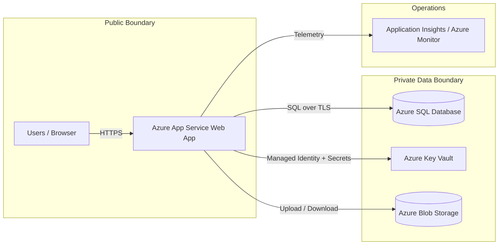

# Architecture Diagram Source

Use this as the basis for a polished diagram in draw.io or another diagram tool.

Callouts to highlight in the final diagram
- Baseline: App Service + Azure SQL + Blob Storage
- Optimization 1: autoscale on the App Service Plan
- Optimization 2: Managed Identity + Key Vault for secrets
- Optional: Application Insights alerts and dashboard

Save the final exported image as `diagram/architecture.png`.
